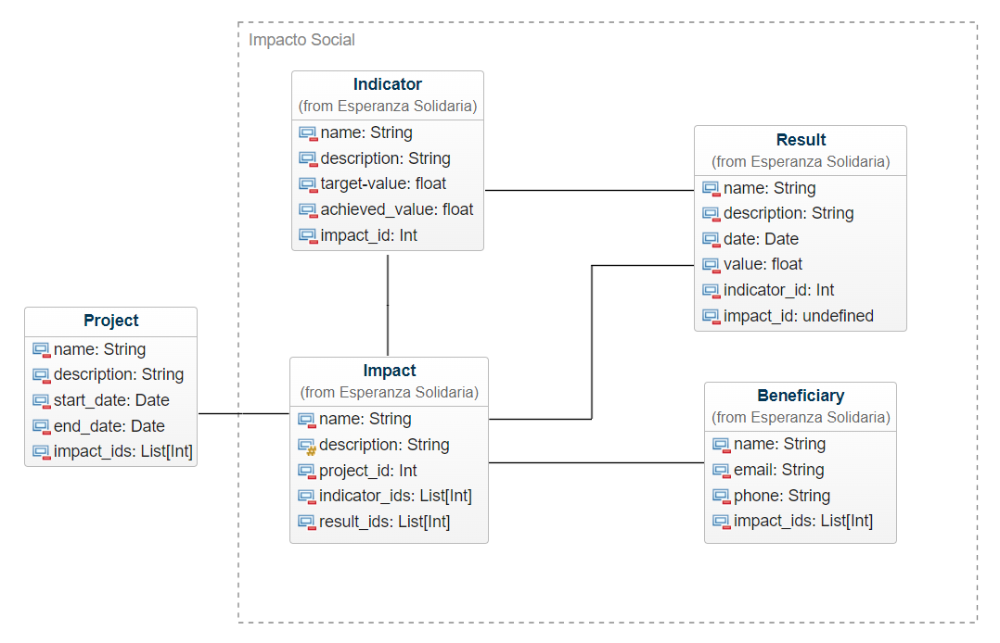

# Módulo Impacto Social 

Este módulo personalizado está diseñado para ayudar a Esperanza Solidaria en su misión de hacer un seguimiento del impacto social de sus proyectos y actividades. Proporciona herramientas integrales para registrar, analizar y comunicar los impactos generados, los beneficiarios involucrados, los indicadores clave de rendimiento y los resultados obtenidos.

## Características

- **Registro de Impactos**: Registra y administra los diversos impactos sociales generados por los proyectos y actividades de Esperanza Solidaria.  
- **Seguimiento de Beneficiarios**: Permite un seguimiento detallado de los beneficiarios directos e indirectos involucrados en cada iniciativa.  
- **Indicadores de Impacto Personalizados**: Define indicadores específicos de impacto social que reflejen los valores y objetivos de Esperanza Solidaria.  
- **Registro de Resultados Detallados**: Registra los resultados cuantitativos y cualitativos obtenidos, permitiendo una evaluación completa del impacto de cada acción.  
- **Visualización de Datos Personalizada**: Ofrece herramientas flexibles para visualizar los datos, incluidos gráficos de barras y otros tipos de visualizaciones adaptadas a las necesidades de Esperanza Solidaria.  
- **Personalización y Adaptabilidad**: Se puede adaptar completamente a los procesos y requisitos únicos de Esperanza Solidaria, asegurando que la solución se ajuste perfectamente a sus necesidades.  

## Uso

1. **Registro de Impactos**: Registre los impactos sociales generados por cada proyecto o actividad, desde mejoras en la salud hasta el empoderamiento económico de las comunidades.  
2. **Seguimiento de Beneficiarios**: Haga un seguimiento de las personas y comunidades que se benefician directa o indirectamente de los programas de Esperanza Solidaria.  
3. **Definición de Indicadores Personalizados**: Defina indicadores de impacto específicos que reflejen los valores y metas de Esperanza Solidaria, como la reducción de la pobreza o el acceso a la educación.  
4. **Registro Detallado de Resultados**: Registre los resultados obtenidos en relación con cada impacto social, desde datos cuantitativos hasta historias de éxito y testimonios de beneficiarios.  
5. **Visualización de Datos y Análisis**: Utilice las herramientas de visualización de datos para analizar los resultados y comunicar el impacto de manera efectiva a las partes interesadas internas y externas.  

Con este módulo, Esperanza Solidaria puede mejorar su capacidad para medir, gestionar y comunicar el impacto social de sus acciones, lo que le permite avanzar hacia sus objetivos de manera más efectiva y transparente.

