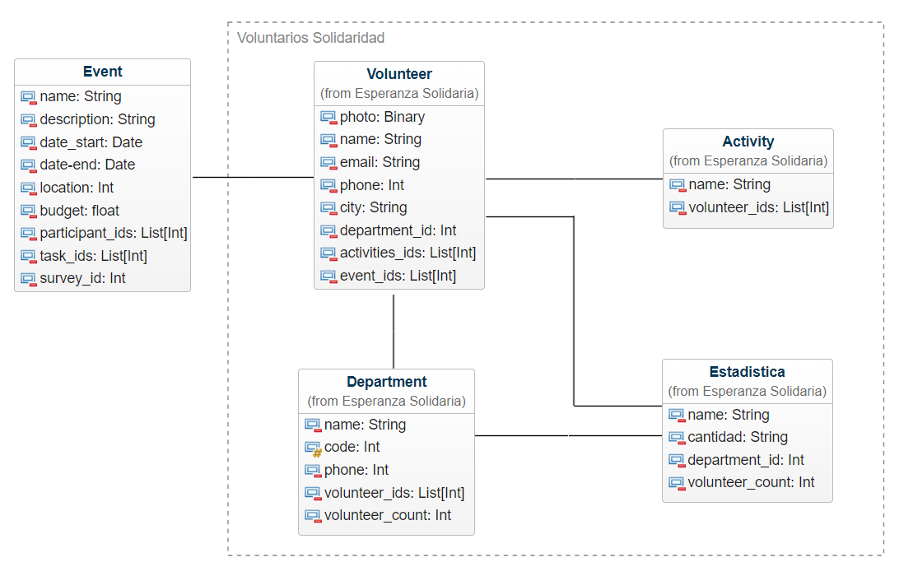
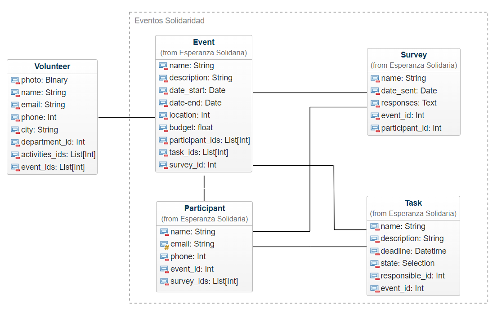

# Módulo Voluntarios Solidarios

Este módulo personalizado está diseñado para ayudar a Esperanza Solidaria en la gestión de voluntarios y departamentos, facilitando el seguimiento de las actividades, estadísticas y la asignación de voluntarios a diferentes áreas de interés.  

## Características

- **Gestión de Voluntarios**: Registra y administra información detallada de los voluntarios, incluyendo su foto, nombre, correo electrónico, teléfono, ciudad y departamento de interés.  

- **Gestión de Departamentos**: Permite la creación y administración de diferentes departamentos dentro de la organización, con detalles como el nombre, código, teléfono y lista de voluntarios asociados.  

- **Gestión de Actividades**: Registra y administra información sobre las actividades realizadas por los voluntarios, incluyendo detalles como el nombre de la actividad y la lista de voluntarios involucrados.  

- **Estadísticas de Voluntarios**: Proporciona estadísticas sobre la cantidad de voluntarios asociados a cada departamento, permitiendo un seguimiento detallado de la participación.  

## Uso

1. **Registro de Voluntarios**: Registre nuevos voluntarios ingresando su información personal y asignándolos a un departamento específico.  

2. **Gestión de Departamentos**: Cree nuevos departamentos y asigne voluntarios a cada uno de ellos según sus intereses y habilidades.  

3. **Registro de Actividades**: Registre las actividades realizadas por los voluntarios, incluyendo los detalles de la actividad y la lista de voluntarios involucrados.  

4. **Seguimiento de Estadísticas**: Realice un seguimiento del número de voluntarios asociados a cada departamento para evaluar la participación y la distribución de recursos.  

Con este módulo, Esperanza Solidaria puede gestionar de manera eficiente su red de voluntarios, departamentos y actividades, facilitando la colaboración y el cumplimiento de sus objetivos solidarios.    

# Módulo Eventos Solidaridad

Este módulo personalizado está diseñado para ayudar a Esperanza Solidaria a gestionar y organizar eventos solidarios de manera eficiente. Proporciona herramientas completas para registrar eventos, administrar participantes, asignar tareas, realizar encuestas de satisfacción y realizar un seguimiento del presupuesto.

## Características

- **Registro de Eventos**: Registra y administra eventos solidarios organizados por Esperanza Solidaria, incluyendo detalles como el nombre, la descripción, la fecha y la ubicación.  
- **Gestión de Participantes**: Permite registrar participantes para cada evento, incluyendo sus datos de contacto y su participación en encuestas de satisfacción.  
- **Asignación de Tareas**: Facilita la asignación y seguimiento de tareas relacionadas con cada evento, con información detallada sobre la descripción, la fecha límite y el responsable.  
- **Encuestas de Satisfacción**: Permite enviar y gestionar encuestas de satisfacción para recopilar retroalimentación de los participantes sobre la experiencia del evento.  
- **Seguimiento del Presupuesto**: Ofrece la capacidad de realizar un seguimiento del presupuesto asignado a cada evento y compararlo con los gastos reales.  

## Uso

1. **Registro de Eventos**: Registre nuevos eventos completando los detalles requeridos, como el nombre, la fecha y la ubicación.  
2. **Gestión de Participantes**: Agregue participantes a cada evento, proporcionando información como nombres, correos electrónicos y números de teléfono.  
3. **Asignación de Tareas**: Asigne tareas específicas a los responsables designados y haga un seguimiento del progreso de cada tarea.  
4. **Realización de Encuestas**: Envíe encuestas de satisfacción a los participantes después de cada evento y recopile sus respuestas para evaluar la experiencia.  
5. **Seguimiento del Presupuesto**: Registre los gastos asociados con cada evento y realice un seguimiento del presupuesto disponible para garantizar una gestión financiera efectiva.  

Con este módulo, Esperanza Solidaria puede planificar, ejecutar y evaluar sus eventos solidarios de manera más organizada y efectiva, lo que contribuye a su misión de generar un impacto positivo en la comunidad.    

# Módulo Impacto Social 

Este módulo personalizado está diseñado para ayudar a Esperanza Solidaria en su misión de hacer un seguimiento del impacto social de sus proyectos y actividades. Proporciona herramientas integrales para registrar, analizar y comunicar los impactos generados, los beneficiarios involucrados, los indicadores clave de rendimiento y los resultados obtenidos.

## Características

- **Registro de Impactos**: Registra y administra los diversos impactos sociales generados por los proyectos y actividades de Esperanza Solidaria.  
- **Seguimiento de Beneficiarios**: Permite un seguimiento detallado de los beneficiarios directos e indirectos involucrados en cada iniciativa.  
- **Indicadores de Impacto Personalizados**: Define indicadores específicos de impacto social que reflejen los valores y objetivos de Esperanza Solidaria.  
- **Registro de Resultados Detallados**: Registra los resultados cuantitativos y cualitativos obtenidos, permitiendo una evaluación completa del impacto de cada acción.  
- **Visualización de Datos Personalizada**: Ofrece herramientas flexibles para visualizar los datos, incluidos gráficos de barras y otros tipos de visualizaciones adaptadas a las necesidades de Esperanza Solidaria.  
- **Personalización y Adaptabilidad**: Se puede adaptar completamente a los procesos y requisitos únicos de Esperanza Solidaria, asegurando que la solución se ajuste perfectamente a sus necesidades.  

## Uso

1. **Registro de Impactos**: Registre los impactos sociales generados por cada proyecto o actividad, desde mejoras en la salud hasta el empoderamiento económico de las comunidades.  
2. **Seguimiento de Beneficiarios**: Haga un seguimiento de las personas y comunidades que se benefician directa o indirectamente de los programas de Esperanza Solidaria.  
3. **Definición de Indicadores Personalizados**: Defina indicadores de impacto específicos que reflejen los valores y metas de Esperanza Solidaria, como la reducción de la pobreza o el acceso a la educación.  
4. **Registro Detallado de Resultados**: Registre los resultados obtenidos en relación con cada impacto social, desde datos cuantitativos hasta historias de éxito y testimonios de beneficiarios.  
5. **Visualización de Datos y Análisis**: Utilice las herramientas de visualización de datos para analizar los resultados y comunicar el impacto de manera efectiva a las partes interesadas internas y externas.  

Con este módulo, Esperanza Solidaria puede mejorar su capacidad para medir, gestionar y comunicar el impacto social de sus acciones, lo que le permite avanzar hacia sus objetivos de manera más efectiva y transparente.

